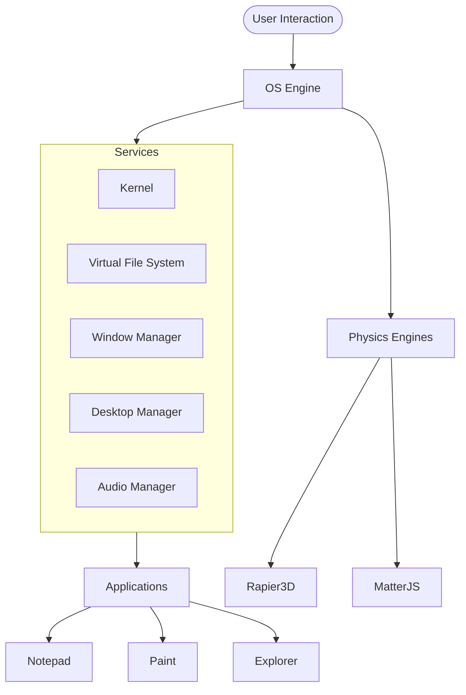

# 🖥️ Windows App Center v1.5.50 (Prototyping Lab)

[](https://opensource.org/licenses/MIT)
[](https://vitejs.dev/)
[](https://www.typescriptlang.org/)

A high-fidelity **Windows 95/98 Simulator & Prototyping Environment** built with modern web technologies. This project serves as a fully functional desktop sandbox for testing and refining modular systems (VFS, Kernel, Rapier3D) before porting them to other production environments.

> [!NOTE]
> This project was audited for stability and performance on March 2026. All core systems including physics and window management are release-ready.

---

## ✨ Features

### 🏢 Desktop Environment
- **Service Container Architecture**: Decoupled systems (Kernel, VFS, UI) for maximum reliability.
- **Virtual File System (VFS)**: Persistent storage using `localStorage` with a hierarchical directory structure.
- **Native Window Manager**: Drag, resize, minimize, and maximize functionality with proper z-index and lifecycle management.
- **Theme Engine**: Switch between "Classic Win95" and "Modern High Contrast" themes on the fly.
- **Event Delegation**: Performance-optimized UI interaction using a data-attribute based event bus.

### 🎮 Ragdoll Pets (2D & 3D)
- **3D Physics Ragdoll**: Powered by **Rapier3D** and **Three.js**. Features elastic grab, procedural animations, and AI state management (Wander, Idle, Perform).
- **2D Stickman Pet**: Interactive Matter.js physics pet that reacts to your mouse, windows, and desktop icons.
- **Workshop**: Customize your pets with skins, scales, and behavioral tweaks.

### 🛠️ Built-in Applications
- 📝 **Notepad**: Save/Load from VFS, find/replace, and native-feel menus.
- 🎨 **Paint**: Fully functional drawing tools, color pickers, and undo/redo history.
- 📂 **File Explorer**: Browse and manage your virtual files and folders.
- 🌐 **Internet Explorer**: Simulated web browsing with history and safety filters.
- 📻 **Webamp**: Authentic Winamp experience for your audio files.
- ⚙️ **Control Panel**: Manage HDR, wallpapers, and system themes.

### 🌈 Advanced Visuals
- **GLSL Wallpaper Engine**: High-performance multi-pass shaders for dynamic desktop backgrounds.
- **HDR Support**: Intelligent detection and toggling of High Dynamic Range rendering.
- **BIOS & Boot**: Realistic startup sequence including BIOS check and splash screens.

---

## 🚀 Getting Started

### Prerequisites
- [Node.js](https://nodejs.org/) (v18+ recommended)
- npm or yarn

### Installation
1. Clone the repository:
   ```bash
   git clone https://github.com/DeViLDoNia/windows-app-center.git
   cd windows-app-center
   ```
2. Install dependencies:
   ```bash
   npm install
   ```
3. Start the development server:
   ```bash
   npm run dev
   ```
4. Build for production:
   ```bash
   npm run build
   ```

---

## 🏗️ Architecture



---

## 📜 License

This project is licensed under the **MIT License** - see the [LICENSE](LICENSE) file for details.

---

## 🙌 Credits & Acknowledgments
- **Author**: HaDeS (A.K.A. DeViLDoNia)
- **Physics**: [Rapier.rs](https://rapier.rs/) & [Matter.js](https://brm.io/matter-js/)
- **Rendering**: [Three.js](https://threejs.org/)
- **Aesthetics**: Inspired by the golden era of computing (1995-2000).
