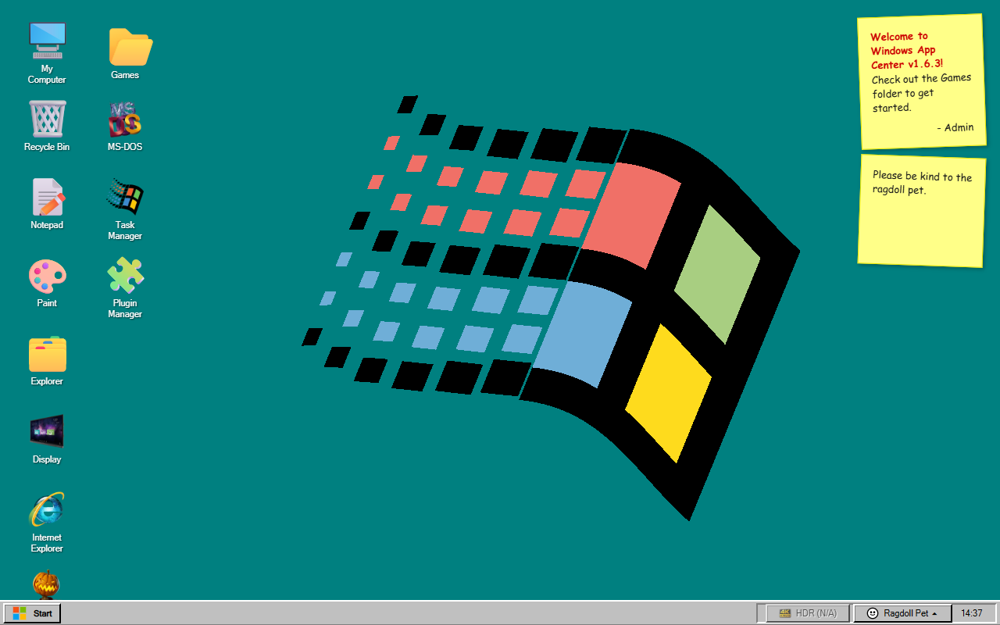
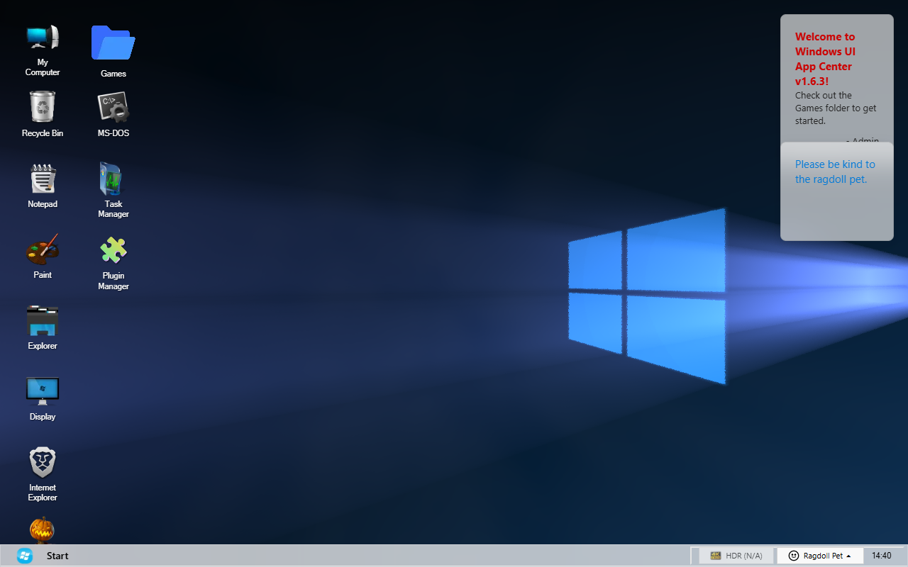
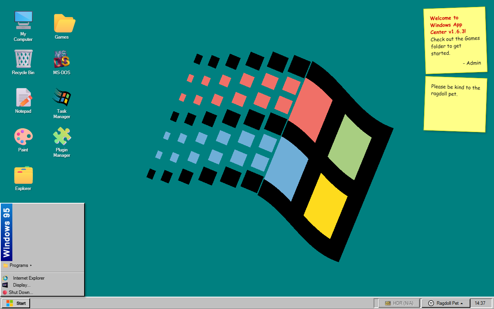
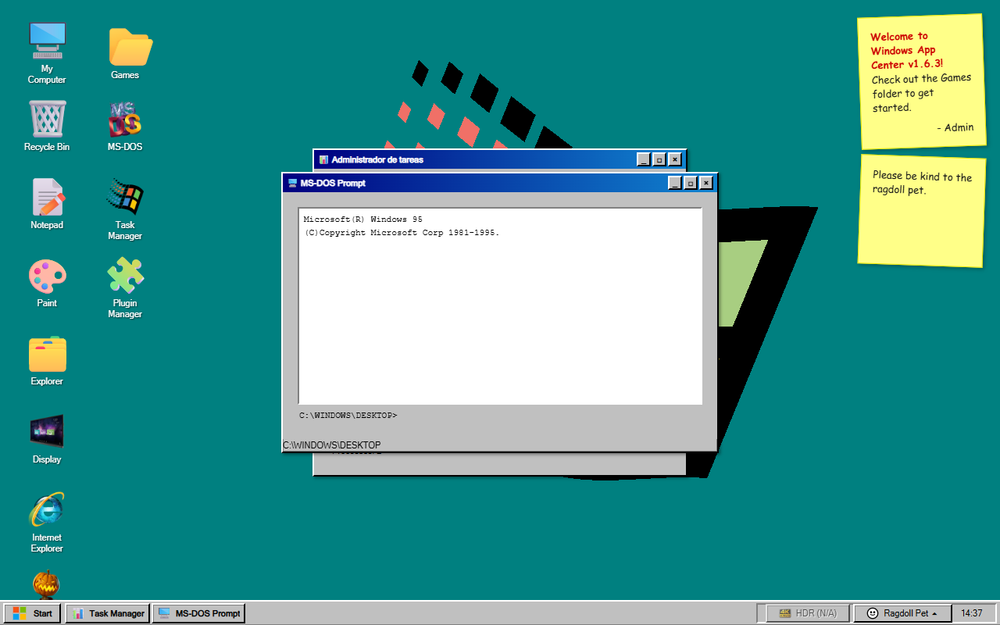
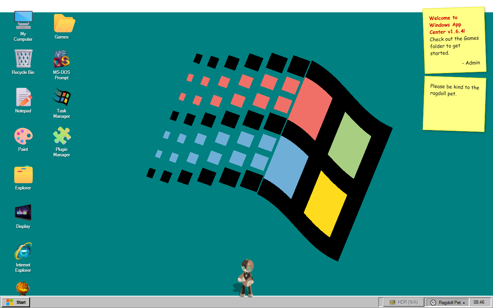
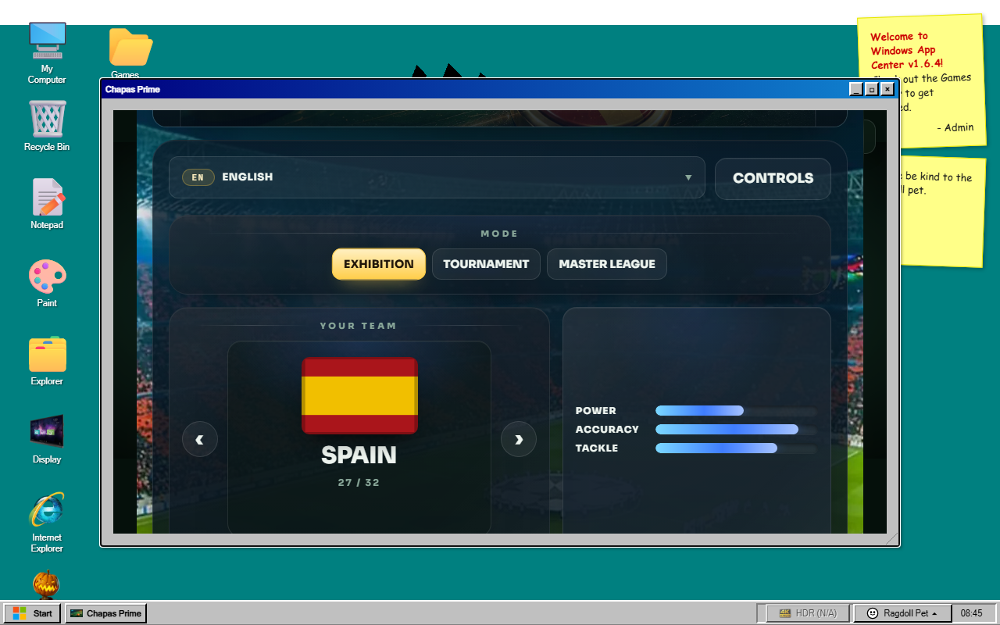
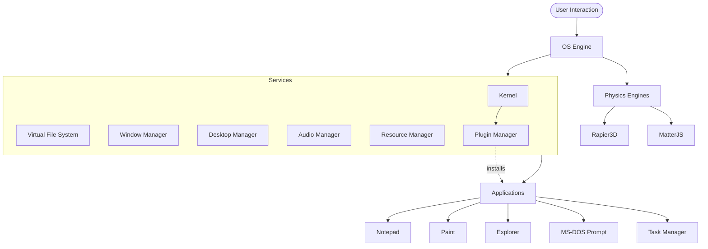

<div align="center">

# 🖥️ Windows App Center

**A high-fidelity Windows 95/98 desktop simulator & modular prototyping lab, built for the modern web.**

[](https://opensource.org/licenses/MIT)
[](https://www.typescriptlang.org/)
[](https://vitejs.dev/)
[](https://threejs.org/)
[](https://vite-pwa-org.netlify.app/)
[](#-testing)
[](https://github.com/DeViLDoNia/windows-app-center/actions/workflows/ci.yml)

### ▶️ **[Live Demo](https://hades-aka-devildonia.itch.io/windows-app-centre)**

<p align="center">
  <a href="https://hades-aka-devildonia.itch.io/windows-app-centre">
    
  </a>
</p>

</div>

---

Windows App Center is a fully functional desktop environment that runs entirely in the browser — but under the retro Win95 chrome sits a deliberately **production-grade architecture**: a process Kernel, a reactive Service Container, a virtual file system, a 3D physics engine, and a 464-test suite. It doubles as a **sandbox for developing modular systems** (VFS, Kernel, Rapier3D, Resource lifecycle) that can be extracted and ported into other projects.

> [!NOTE]
> Audited for stability, security, and performance (July 2026). See the [CHANGELOG](CHANGELOG.md) for the full version history.

## 📋 Table of Contents
- [Why this exists](#-why-this-exists)
- [Screenshots](#-screenshots)
- [Features](#-features)
- [Tech Stack](#-tech-stack)
- [Getting Started](#-getting-started)
- [Usage](#-usage)
- [Testing](#-testing)
- [Architecture](#-architecture)
- [Project Structure](#-project-structure)
- [Creating an App](#-creating-an-app)
- [PWA & Offline](#-pwa--offline)
- [Browser Support](#-browser-support)
- [Roadmap](#-roadmap)
- [Known Limitations](#-known-limitations)
- [Contributing](#-contributing)
- [License & Credits](#-license)

---

## 🎯 Why this exists

The "desktop in the browser" space is crowded — so this project leans on **engineering quality** rather than feature count:

- 🧠 **Real OS primitives, not a mockup.** A process `Kernel` with a live registry, a dependency-injected `Service Container`, an event-driven core, and per-owner resource lifecycle management.
- 🦴 **A 3D physics pet.** An interactive ragdoll powered by **Rapier3D + Three.js** with grab physics, procedural animation, and an AI state machine — a differentiator you won't find in most desktop clones.
- 🔬 **Determinism by design.** Zero `Math.random()` in logic paths; seeded PRNG where reproducibility matters. Hot paths are zero-allocation with a fixed-timestep loop.
- ✅ **464 tests** (unit, characterization & Playwright E2E) with coverage gates in CI — rare in this niche.
- 🎨 **Intentional aesthetics.** Pixel-accurate Win95 chrome plus a "Modern" theme, driven by a token-based theme engine — no AI-default look.
- 🧩 **Built to be extended.** Auto-registering apps, a scaffolder (`npm run generate:app`), and a runtime plugin API.

---

## 📸 Screenshots

| Classic Win95 | Modern (Windows UI) |
|:---:|:---:|
|  |  |
| **Start Menu** | **Multitasking — Task Manager & MS-DOS Prompt** |
|  |  |
| **3D Physics Ragdoll** | **Games Arcade (sandboxed)** |
|  |  |

---

## ✨ Features

### 🏢 Desktop Environment
- **Process Kernel** — a real process table (`launch`/`kill`, PID registry, singleton handling) that owns every app's lifecycle.
- **Service Container (DI)** — decoupled systems (Kernel, VFS, Window Manager, Audio, Resource Manager) resolved through a typed registry.
- **Virtual File System** — hierarchical directories persisted to `localStorage` with debounced writes and quota handling.
- **Native Window Manager** — drag, resize, minimize, maximize, z-index focus, and deterministic teardown.
- **Resource Manager** — owner-scoped registry (WebGL, audio, listeners, timers) with LIFO disposal for leak-free cleanup.
- **Theme Engine** — switch between *Classic Win95* and *Modern* live; all UI is token-driven.
- **Plugin API** — validate and register/unregister third-party apps at runtime through the Kernel.
- **♿ Accessibility** — ARIA roles, Alt+Tab window switcher, focus management, and an `aria-live` screen-reader announcer.

### 🎮 Ragdoll Pets (2D & 3D)
- **3D Physics Ragdoll** — Rapier3D + Three.js, with elastic grab, procedural animation, and AI states (Wander / Idle / Perform).
- **2D Stickman Pet** — Matter.js physics pet that reacts to the mouse, windows, and desktop icons.
- **Workshop** — customize skins, scale, and behavior.

### 🛠️ Built-in Applications
📝 Notepad (VFS save/load, find & replace, multi-window) · 🎨 Paint (tools, color pickers, undo/redo) · 📂 File Explorer · 🌐 Internet Explorer (history + URL safety filter) · 📻 Webamp · ⚙️ Control Panel & Settings (HDR, wallpapers, themes, language) · 🖥️ **MS-DOS Prompt** (VFS-backed shell) · 📊 **Task Manager** (live process monitor) · 🧩 **Plugin Manager**.

### 🕹️ Games Arcade
Sandboxed in isolated iframes and registered with the Kernel: 🎮 Virtual Life Restart Sim · 🐦 Flappy Neon · ⚽ Football Rush · 🔫 Ultimate DOOM · 🧱 Tetris Tryhard · 🔴 Chapas Prime (Three.js) · 🌙 Nocturna (Web Audio rhythm) · 👾 H.I.P. Game Boy (3D WebGL).

### 🌈 Advanced Visuals
- **GLSL Wallpaper Engine** — multi-pass shaders for dynamic backgrounds.
- **HDR Support** — detection and toggling of High Dynamic Range rendering.
- **BIOS & Boot** — realistic startup sequence with BIOS check and splash.

---

## 🧰 Tech Stack

| Layer | Technology |
|---|---|
| Language | TypeScript 5.9 (`strict`, zero `@ts-ignore`) |
| Build / Dev | Vite 5, `vite-plugin-pwa` (Workbox `injectManifest`) |
| 3D / Physics | Three.js r183, Rapier3D (WASM) |
| 2D Physics | Matter.js |
| Audio | Web Audio API (procedural synthesis) |
| Graphics | WebGL2, GLSL shaders |
| Testing | Vitest 4 (+ v8 coverage), Playwright |
| Tooling | ESLint (typescript-eslint), Tailwind (games build only) |

---

## 🚀 Getting Started

### Prerequisites
- [Node.js](https://nodejs.org/) **v18+**
- npm (or yarn)

### Installation
```bash
# 1. Clone
git clone https://github.com/DeViLDoNia/windows-app-center.git
cd windows-app-center

# 2. Install
npm install

# 3. Run the dev server (http://localhost:3000)
npm run dev

# 4. Production build + local preview
npm run build
npm run preview
```

---

## 🎮 Usage

**Opening apps:** double-click a desktop icon or use the **Start Menu**.

**Keyboard shortcuts**
| Shortcut | Action |
|---|---|
| `Alt` + `Tab` | Cycle windows forward |
| `Shift` + `Alt` + `Tab` | Cycle windows backward |
| `Shift` + `F10` | Context menu |

**MS-DOS Prompt commands**
```text
help            Show available commands
ver             Print version info
dir / ls        List the current directory
cd <dir>        Change directory (supports .. and absolute C:\ paths)
type / cat      Print a file's contents
echo <t> > file Write text to a file
mkdir <name>    Create a directory
del / rm <n>    Delete a file or directory
ren <old> <new> Rename
cls / clear     Clear the screen
```
Use `↑` / `↓` to navigate command history.

---

## ✅ Testing

**464 tests across 43 files** — unit, *characterization* (behavior-locking tests for the Kernel, Window Manager, and Audio Manager), and Playwright end-to-end boot/interaction specs. Coverage thresholds are enforced as blocking CI gates.

```bash
npm test              # watch mode
npm run test:run      # single run (verbose)
npm run test:ui       # Vitest UI
npm run test:coverage # coverage report (v8)
npm run test:e2e      # Playwright E2E
npm run typecheck     # tsc --noEmit
npm run lint          # ESLint
```

**CI (GitHub Actions):** runs on every push/PR to `main`. `typecheck`, `lint`, and `test:run` are blocking quality gates; E2E runs as an informative check.

---

## 🏗️ Architecture



### Architecture highlights
- **Kernel** — a `Map<pid, process>` registry with immediate cleanup on `kill()` and automatic `terminate()` propagation to app instances. Singleton apps refocus their running instance instead of duplicating.
- **Event-driven core** — a zero-allocation event bus where each handler is isolated (one failing listener never breaks the others), plus a reactive, persisted store.
- **Service Container** — a typed DI registry with async resolution (`whenReady`) and HMR-safe `unregister`.
- **Resource Manager** — owner-scoped disposables with LIFO teardown; `Kernel.kill()` and each app's `terminate()` release their WebGL contexts, audio nodes, listeners, and timers deterministically.
- **Determinism** — logic paths avoid `Math.random()`; hot paths use preallocated buffers and a fixed-timestep accumulator with render interpolation.

---

## 📁 Project Structure

```text
windows-app-center/
├─ js/
│  ├─ core/        # Kernel, EventBus, Store, Service Container, VFS,
│  │               # ResourceManager, PluginManager, Ragdoll3D core…
│  ├─ apps/        # Notepad, Paint, Terminal, TaskManager, Explorer… (auto-registered)
│  ├─ ui/          # WindowFactory, TouchManager, ShaderWallpaper…
│  ├─ audio/       # AudioManager, procedural synth
│  ├─ services/    # i18n and other cross-cutting services
│  └─ utils.ts     # shared helpers (escapeHTML, eventManager, logger…)
├─ public/
│  ├─ games/       # sandboxed iframe games
│  ├─ css/themes/  # theme-base / theme-win95 / theme-modern tokens
│  └─ sw.js        # PWA service worker source (Workbox injectManifest)
├─ test/           # Vitest unit/characterization + Playwright E2E
├─ scripts/        # create-app.js scaffolder
└─ main.ts         # entry — auto-registers every app in js/apps/*
```

---

## 🧩 Creating an App

Apps **auto-register** — any file in `js/apps/*.ts` that calls `Kernel.registerApp(...)` is picked up automatically (no manual wiring). Scaffold one with:

```bash
npm run generate:app
```

Or write it by hand (see `js/apps/MyTestApp.ts` for the full template):

```ts
import { Kernel } from '../core/Kernel.js';
import { WindowFactory } from '../ui/WindowFactory.js';
import type { IWindowsApp } from '../core/Types.js';

export class MyApp implements IWindowsApp {
  public windowId = '';
  constructor() {
    this.windowId = WindowFactory.create({ title: 'My App', icon: '🧪', width: 400, height: 300 });
    // …render into WindowFactory.getBody(this.windowId)…
  }
  terminate(): void {
    // release listeners/timers, then:
    WindowFactory.destroy(this.windowId);
  }
}

Kernel.registerApp('myapp', MyApp, { name: 'My App', icon: '🧪', singleton: false });
```

**Runtime plugins:** third-party `IAppPlugin` definitions are validated by `PluginManager.validatePlugin` (ID pattern, required metadata, constructor check, duplicate-ID guard) and registered via `Kernel.installPlugin` / removed with `Kernel.uninstallPlugin`.

---

## 📦 PWA & Offline

The app ships as an installable PWA. A Workbox service worker (generated from the real build via `vite-plugin-pwa`'s `injectManifest`) precaches the app shell, so it launches offline after the first visit and can be installed to the desktop/home screen.

---

## 🌍 Browser Support

Best experienced in a recent **Chromium-based browser** (Chrome, Edge, Brave). Requires **WebGL2** for the 3D ragdoll and shader wallpapers. Firefox and Safari run the desktop and 2D features; some heavy 3D/HDR effects and the JS-heap readout in Task Manager are Chromium-only.

---

## 🗺️ Roadmap

- **Settings hub** — a Windows-style settings app with a category sidebar (Language & Region live language switcher shipped first). *(in progress)*
- **i18n hardening** — compile-time-checked translation keys and locale key-parity tests.
- Deeper plugin loading (sandboxed `src` plugins in isolated iframes).
- Automated leak-budget E2E (open/close each app N times; assert resource counters return to baseline).

See the [CHANGELOG](CHANGELOG.md) `[Unreleased]` section for the latest.

---

## ⚠️ Known Limitations

- **Persistence** is `localStorage`-backed (~5 MB per origin); the VFS is not meant for large files.
- **Single-user / client-side only** — no accounts, no server sync.
- **Plugin Manager install UI** currently validates and manages plugins, but loading arbitrary third-party code from a URL is intentionally stubbed pending a sandboxed loader (see Roadmap) — by design, no untrusted code is `eval`'d.
- Fake "hardware" figures in the Task Manager *System* tab are **simulated** (deterministic), not real device telemetry.

---

## 🤝 Contributing

Contributions are welcome! Please open an issue to discuss substantial changes first. Before submitting a PR, make sure `npm run typecheck`, `npm run lint`, and `npm run test:run` pass. New apps should include a matching test file and register via the `js/apps/*` auto-loader.

---

## 📜 License

Licensed under the **MIT License** — see [LICENSE](LICENSE).

## 🙌 Credits

- **Author:** HaDeS (A.K.A. DeViLDoNia) — [GitHub](https://github.com/DeViLDoNia)
- **Physics:** [Rapier.rs](https://rapier.rs/) & [Matter.js](https://brm.io/matter-js/)
- **Rendering:** [Three.js](https://threejs.org/)
- **Aesthetics:** inspired by the golden era of computing (1995–2000).

<div align="center"><sub>© HaDeS 2026 · Built with intention.</sub></div>
